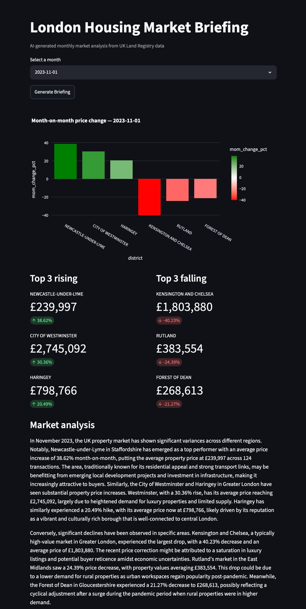

# London Housing — Analytics Engineering Pipeline

**Stack:** dbt · DuckDB · Python · S3 · Streamlit · OpenAI · Docker · GitHub Actions

End-to-end analytics pipeline for UK residential property sales. Ingests HM Land Registry Price Paid data from S3, transforms it through a layered dbt model layer, and surfaces it through a Streamlit app that generates AI-written market briefings.

## Streamlit app



## Architecture

```text
S3 (raw CSVs)
    └── ingest/load_raw.py       # loads raw_transactions, raw_hpi into DuckDB
        └── staging/             # clean column names, cast types, decode codes
            └── intermediate/    # filter non-market transfers, add price bands & date parts
                └── marts/       # fct_transactions, fct_price_index, dim_location, dim_property, dim_time
                    └── app/     # Streamlit reads from DuckDB → OpenAI generates briefing
```

## Data sources

| Source | Description |
| --- | --- |
| HM Land Registry Price Paid | Individual property transactions across England & Wales |
| UK House Price Index (HPI) | Monthly regional average prices and index values |

Both datasets are stored as CSV files in an S3 bucket and loaded into DuckDB via `ingest/load_raw.py`.

## Project structure

```text
london_housing/
├── ingest/
│   └── load_raw.py                        # S3 → DuckDB ingestion
├── models/
│   ├── staging/
│   │   ├── stg_transactions.sql           # decoded property types, tenure, address cleanup
│   │   └── stg_hpi.sql                    # renamed HPI columns, buyer/transaction type splits
│   ├── intermediate/
│   │   ├── int_transactions_enriched.sql  # filters non-market transfers, adds price bands
│   │   └── int_price_index.sql            # monthly district aggregates with MoM change
│   └── marts/
│       ├── fct_transactions.sql
│       ├── fct_price_index.sql
│       ├── dim_location.sql
│       ├── dim_property.sql
│       └── dim_time.sql
├── app/
│   ├── streamlit.py                       # Streamlit UI
│   ├── queries.py                         # DuckDB query functions
│   └── briefing_generator.py             # OpenAI market briefing
└── utils/                                 # schema sniffing and bucket inspection scripts
```

## Quickstart

### 1. Environment setup

```bash
python -m venv env && source env/bin/activate
pip install -r requirements.txt
```

### 2. Configure credentials

Create a `.env` file in the project root:

```env
AWS_KEY_ID=your_key
AWS_SECRET=your_secret
AWS_REGION=eu-west-2
AWS_BUCKET=victor-london-housing-analytics
OPENAI_API_KEY=your_key
```

### 3. Configure dbt profile

Add to `~/.dbt/profiles.yml`:

```yaml
london_housing:
  target: dev
  outputs:
    dev:
      type: duckdb
      path: ../london_housing.duckdb
      threads: 1
```

### 4. Run the pipeline

```bash
cd london_housing
python ingest/load_raw.py   # ingest from S3
dbt run                     # build all models
dbt test                    # run data quality tests
```

### 5. Run the app

```bash
streamlit run london_housing/app/streamlit.py
```

## Deployment

Deployed via Docker Compose with Caddy handling HTTPS automatically. GitHub Actions deploys on every push to `main`.

## Resources

- [dbt docs](https://docs.getdbt.com)
- [Land Registry Price Paid Data](https://www.gov.uk/government/collections/price-paid-data)
- [UK House Price Index](https://www.gov.uk/government/collections/uk-house-price-index-reports)
